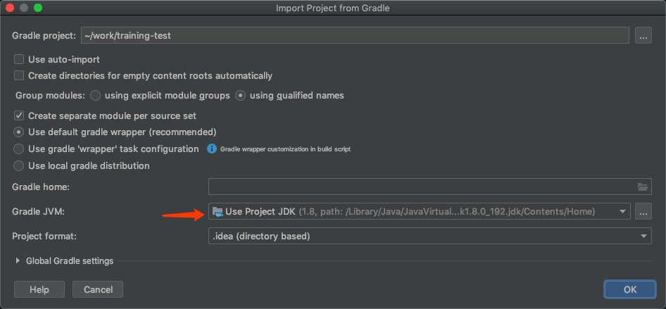

非计测试题目-后端
----

## 准备开发环境
### 1. 下载代码库

``` bash
git clone https://github.com/coney/non-cs-training-test.git
```

### 2. 导入工程

打开Intellij Idea, 点击Open打开工程:


选择刚刚Clone下来的工程所在目录:


导入Gradle工程, 使用默认选项即可, 注意JDK版本设置为1.8:



接下来Idea将会下载相应的Gradle Wrapper和相关依赖, 待工作进度条完成消失后, 验证工程是否被正确导入

### 3. 验证开发

打开`SubjectTest.java`, 点击`SubjectTest`类左边的运行图标, 执行所有测试用例.

运行结果如下图所示, task_0应该能够通过测试, 其他用例均执行失败.  


task_0为我们验证环境使用的测试用例, 我们后续的测试则需要同学们进行相应的编码实现, 并通过测试用例验证实现的正确性.

## 测试题目

### 1 编程题: 数组过滤及累加

从输入的数组中过滤掉所有奇数, 将剩余的偶数累加并返回:

```java
@Test
public void task_1() {
    final int[] inputs1 = new int[]{1, 2, 3, 4};
    assertThat(Subject.solveTask1(inputs1), is(6));

    final int[] inputs2 = new int[]{1, 2, 3, 4, 5, 6, 7, 8, 9};
    assertThat(Subject.solveTask1(inputs2), is(20));

    final int[] inputs3 = new int[]{1, 1, 2, 3, 5, 8, 13, 21, 34, 55, 89, 144};
    assertThat(Subject.solveTask1(inputs3), is(188));
}
```

### 2 问答题: 重写和重载
Java中的重写（Overriding）和重载（Overloading）是什么意思

### 3 编程题: 学生与老师类的抽象与继承
分别构造Student和Teacher对象, 构造函数参数为他们所属班级号, 他们的共同父类是Person类.
当调用父类中声明的report方法时, 两个对象分别以字符串方式返回自己的角色和所属班级

```java
@Test
public void task_3() {
    final Person studentFromClass1 = new Student(1);
    assertThat(studentFromClass1.report(), is("I am a student from Class 1"));

    final Person teacherFromClass2 = new Teacher(2);
    assertThat(teacherFromClass2.report(), is("I am a teacher from Class 2"));
}
```

### 4 问答题: 电器抽象
电器是指以电能来进行驱动的用具，冰箱、烤箱、蒸箱、微波炉都是电器，
现在市面上出现了一种集成度更高的产品，同时具备蒸、烤、微波的一体机。
请根据你对这些电器的理解来设计类/接口

### 5 编程题: 成绩单过滤 
根据输入的成绩单列表过滤及格的(60分及格线)成绩, 并输出成绩最高的成绩单姓名
1. 过滤掉所有不及格成绩
2. 从及格成绩中找出得分最高的成绩单并以字符串返回姓名
3. 如果没有及格成绩则跑出RuntimeException

**请优先使用Java Stream API及Lambda**

```java
@Test
public void task_4() {
    final Score alice = new Score("alice", 87);
    final Score bob = new Score("bob", 45);
    final Score charlie = new Score("charlie", 59);
    final Score david = new Score("david", 91);

    // 过滤出及格的成绩单, 返回姓名
    final List<Score> scoreList1 = Arrays.asList(alice, bob, charlie);
    assertThat(Subject.solveTask4(scoreList1), is("alice"));

    // 当有多个成绩及格时, 返回成绩最高的姓名
    final List<Score> scoreList2 = Arrays.asList(alice, bob, charlie, david);
    assertThat(Subject.solveTask4(scoreList2), is("david"));

    // 当没有成绩及格时, 抛出RuntimeException
    final List<Score> scoreList3 = Arrays.asList(bob, charlie);
    exceptionRule.expect(RuntimeException.class);
    Subject.solveTask4(scoreList3);
}
```
